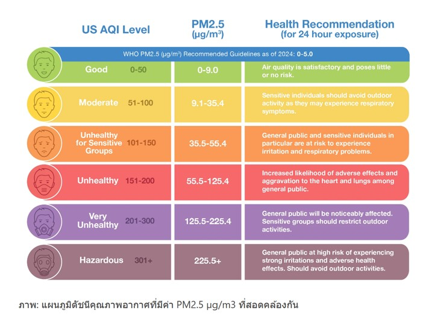
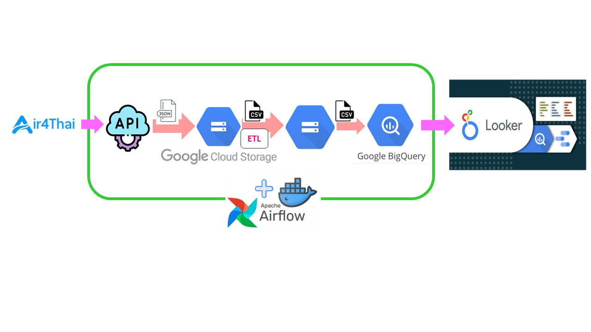

# DS525-capstone-project

## Problem

"ระบบการตรวจวัดและจัดเก็บข้อมูลคุณภาพอากาศในพื้นที่ในประเทศไทย อ้างอิงดัชนีคุณภาพอากาศ (AQI)”

**ที่มาและความสำคัญของปัญหา:**

มลพิษทางอากาศเป็นปัญหาสิ่งแวดล้อมที่ส่งผลกระทบรุนแรงต่อสุขภาพของประชาชน โดยเฉพาะในพื้นที่เสี่ยงสูง เช่น ชุมชนแออัดและบริเวณใกล้แหล่งกำเนิดมลพิษ ปัจจุบันการตรวจวัดคุณภาพอากาศในประเทศไทยมักกระจุกตัวอยู่ในพื้นที่เมืองใหญ่ ขาดความละเอียดและไม่ครอบคลุมพื้นที่เสี่ยงดังกล่าว ส่งผลให้ไม่สามารถติดตามและควบคุมสถานการณ์ได้อย่างทันท่วงที เพื่อเฝ้าระวังและแจ้งเตือนประชาชนในพื้นที่เสี่ยงได้อย่างมีประสิทธิภาพ

นอกจากนี้ ข้อมูลคุณภาพอากาศในปัจจุบันยังกระจัดกระจายและขาดการจัดเก็บอย่างเป็นระบบ ทำให้ไม่สามารถนำมาวิเคราะห์และวางแผนการจัดการมลพิษในระดับพื้นที่ย่อยได้อย่างมีประสิทธิภาพ



**วัตถุประสงค์ของโครงงาน:**

พัฒนาเครือข่ายเซนเซอร์ตรวจวัดคุณภาพอากาศแบบพกพาและต่อเนื่องในพื้นที่เสี่ยงต่างๆ
จัดเก็บและรายงานผลการตรวจวัดแบบเรียลไทม์ผ่านระบบแจ้งเตือนเพื่อการเฝ้าระวังในพื้นที่เสี่ยง
สร้างคลังข้อมูลคุณภาพอากาศระดับจุลภาคที่ครอบคลุมพื้นที่เสี่ยงทั่วประเทศ

**ประโยชน์ที่คาดว่าจะได้รับ:**

ระบบนี้จะช่วยแก้ปัญหาการขาดข้อมูลที่ละเอียดและทันสมัยในพื้นที่เสี่ยง ช่วยให้สามารถติดตาม ควบคุม และเฝ้าระวังสถานการณ์คุณภาพอากาศได้อย่างใกล้ชิดและทันท่วงที รวมถึงมีข้อมูลเชิงลึกสำหรับการวิเคราะห์และวางแผนเชิงนโยบายในการจัดการมลพิษทางอากาศในระดับพื้นที่ย่อยได้อย่างมีประสิทธิภาพ ซึ่งจะส่งผลให้สามารถปกป้องสุขภาพของประชาชนในพื้นที่เสี่ยงได้ดียิ่งขึ้น


## Project 

**Project Overview**



**Data source**

AIR4THAI - เป็นข้อมูลจากกองจัดการคุณภาพอากาศและเสียง กรมควบคุมมลพิษ ที่ให้บริการบนเว็บ air4thai.pcd.go.th โดยจะปรับปรุงข้อมูลทุก ๆ 1 ชั่วโมง ซึ่งมีสถานีตรวจวัดคุณภาพอากาศกระจายอยู่ทั่วประเทศไทย จำนวน 183 สถานี

AIR4THAI มี API แบบ JSON ให้เราสามารถดึงไปใช้งานได้จาก link : http://air4thai.pcd.go.th/services/getNewAQI_JSON.php

ข้อมูลคุณภาพอากาศจะถูกดึงมาจาก API ของ air4thai.pcd.go.th โดยจะประกอบไปด้วยข้อมูลดังต่อไปนี้

* station_id: รหัสสถานีตรวจวัดคุณภาพอากาศ
* date: วันที่ของการตรวจวัด
* time: เวลาของการตรวจวัด
* date_time: วันที่และเวลาของการตรวจวัดรวมกัน
* aqi_val: ค่า Air Quality Index (AQI)
* aqi_color_id: รหัสสีที่แสดงระดับของ 
* AQIco_val: ค่าความเข้มข้นของก๊าซคาร์บอนมอนอกไซด์ (CO)
* co_color_id: รหัสสีที่แสดงระดับของ CO
* no2_val: ค่าความเข้มข้นของก๊าซไนโตรเจนไดออกไซด์ (NO2)
* no2_color_id: รหัสสีที่แสดงระดับของ NO2
* o3_val: ค่าความเข้มข้นของก๊าซโอโซน (O3)o3_color_id: รหัสสีที่แสดงระดับของ O3
* pm10_val: ค่าความเข้มข้นของฝุ่นละอองขนาดไม่เกิน 10 ไมครอน (PM10)
* pm10_color_id: รหัสสีที่แสดงระดับของ PM10
* pm25_val: ค่าความเข้มข้นของฝุ่นละอองขนาดไม่เกิน 2.5 ไมครอน (PM2.5)
* pm25_color_id: รหัสสีที่แสดงระดับของ PM2.5
* so2_val: ค่าความเข้มข้นของก๊าซซัลเฟอร์ไดออกไซด์ (SO2)
* so2_color_id: รหัสสีที่แสดงระดับของ SO2


### ETL

** Extract
    

** Transform

    lat & long to lat, long

    time from hh:mm to hh:mm:ss

    date & time to datetime

** Load


Data visualization link : https://lookerstudio.google.com/u/1/reporting/4e52fc91-1a57-480b-99fa-f6ecea4715ee/page/C8xyD

## instruction

### Prepare the Database on Google Bigquery


### Run the Airflow DAGs

- Run Docker compose 

``` sh
    docker-compose up
```

- Go to Apache Airflow GUI page at port 8888

- Enter 'username' and 'password'

- Enable and Run the DAGs name 'get_air4thai'

## Project Team

* 
* 
* 
* 
* 
* 
* 
* 
