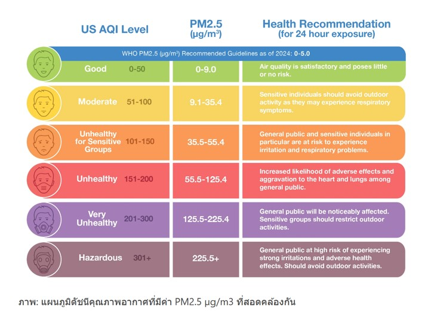
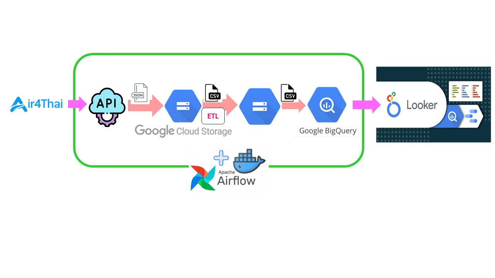
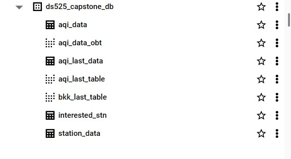
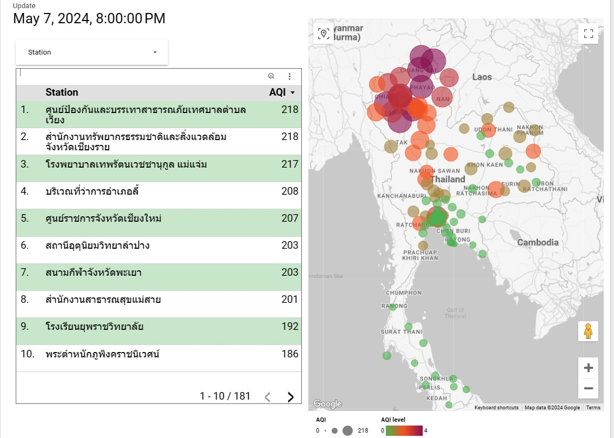
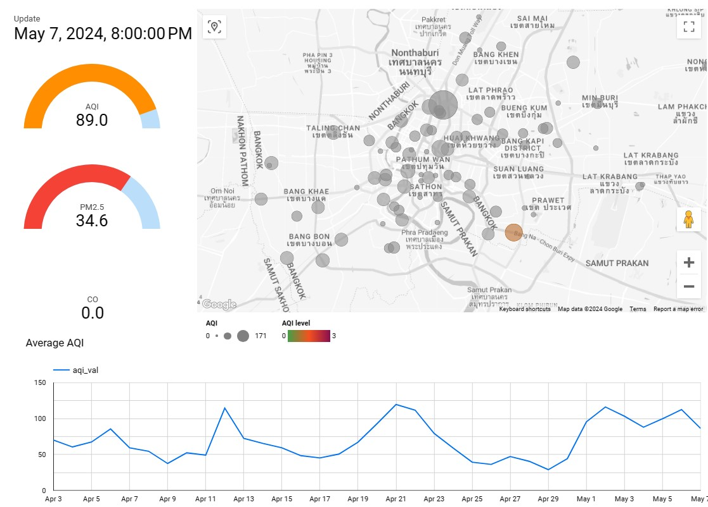

# DS525-capstone-project

## Problem

"ระบบการตรวจวัดและจัดเก็บข้อมูลคุณภาพอากาศในพื้นที่ในประเทศไทย อ้างอิงดัชนีคุณภาพอากาศ (AQI)”

**ที่มาและความสำคัญของปัญหา:**

มลพิษทางอากาศเป็นปัญหาสิ่งแวดล้อมที่ส่งผลกระทบรุนแรงต่อสุขภาพของประชาชน โดยเฉพาะในพื้นที่เสี่ยงสูง เช่น ชุมชนแออัดและบริเวณใกล้แหล่งกำเนิดมลพิษ ปัจจุบันการตรวจวัดคุณภาพอากาศในประเทศไทยมักกระจุกตัวอยู่ในพื้นที่เมืองใหญ่ ขาดความละเอียดและไม่ครอบคลุมพื้นที่เสี่ยงดังกล่าว ส่งผลให้ไม่สามารถติดตามและควบคุมสถานการณ์ได้อย่างทันท่วงที เพื่อเฝ้าระวังและแจ้งเตือนประชาชนในพื้นที่เสี่ยงได้อย่างมีประสิทธิภาพ

นอกจากนี้ ข้อมูลคุณภาพอากาศในปัจจุบันยังกระจัดกระจายและขาดการจัดเก็บอย่างเป็นระบบ ทำให้ไม่สามารถนำมาวิเคราะห์และวางแผนการจัดการมลพิษในระดับพื้นที่ย่อยได้อย่างมีประสิทธิภาพ



**วัตถุประสงค์ของโครงงาน:**

1. เพื่อสร้างระบบการตรวจวัดคุณภาพอากาศที่ทันสมัย ครอบคลุมพื้นที่ต่างๆ ในประเทศไทย โดยอ้างอิงดัชนีคุณภาพอากาศ (AQI) ซึ่งเป็นมาตรฐานสากล
2. เพื่อรวบรวมและจัดเก็บข้อมูลคุณภาพอากาศอย่างเป็นระบบ สามารถเรียกใช้และวิเคราะห์ข้อมูลได้อย่างมีประสิทธิภาพ
3. เพื่อสร้างระบบการแจ้งเตือนประชาชนเมื่อคุณภาพอากาศอยู่ในระดับที่เป็นอันตรายต่อสุขภาพ
4. เพื่อให้มีข้อมูลคุณภาพอากาศที่ถูกต้อง ทันสมัย สามารถนำไปใช้ในการวางแผนและกำหนดนโยบายในการจัดการปัญหามลพิษอากาศได้อย่างมีประสิทธิผล


**ประโยชน์ที่คาดว่าจะได้รับ:**

1. มีข้อมูลคุณภาพอากาศที่ครอบคลุมพื้นที่ต่างๆ ในประเทศไทย ซึ่งจะเป็นประโยชน์ต่อการวางแผนและกำหนดนโยบายในการจัดการปัญหามลพิษอากาศได้อย่างมีประสิทธิภาพ
2. ประชาชนสามารถเข้าถึงข้อมูลคุณภาพอากาศในพื้นที่ของตนเองได้อย่างสะดวก และได้รับการแจ้งเตือนเมื่อคุณภาพอากาศอยู่ในระดับที่เป็นอันตรายต่อสุขภาพ
3. หน่วยงานที่เกี่ยวข้องสามารถนำข้อมูลไปใช้ในการวางแผนและดำเนินการป้องกันและแก้ไขปัญหามลพิษอากาศได้อย่างทันท่วงที
4. ช่วยลดผลกระทบต่อสุขภาพของประชาชนจากปัญหามลพิษอากาศ และส่งเสริมให้มีคุณภาพชีวิตที่ดีขึ้น
5. เป็นการยกระดับมาตรฐานการตรวจวัดและจัดเก็บข้อมูลคุณภาพอากาศของประเทศไทยให้เทียบเท่ามาตรฐานสากล


## Project 

**Project Overview**



**Data source**

AIR4THAI - เป็นข้อมูลจากกองจัดการคุณภาพอากาศและเสียง กรมควบคุมมลพิษ ที่ให้บริการบนเว็บ air4thai.pcd.go.th โดยจะปรับปรุงข้อมูลทุก ๆ 1 ชั่วโมง ซึ่งมีสถานีตรวจวัดคุณภาพอากาศกระจายอยู่ทั่วประเทศไทย จำนวน 183 สถานี

AIR4THAI มี API แบบ JSON ให้เราสามารถดึงไปใช้งานได้จาก link : http://air4thai.pcd.go.th/services/getNewAQI_JSON.php

ข้อมูลคุณภาพอากาศจะถูกดึงมาจาก API ของ air4thai.pcd.go.th โดยจะประกอบไปด้วยข้อมูลดังต่อไปนี้

* station_id: รหัสสถานีตรวจวัดคุณภาพอากาศ
* date: วันที่ของการตรวจวัด
* time: เวลาของการตรวจวัด
* date_time: วันที่และเวลาของการตรวจวัดรวมกัน
* aqi_val: ค่า Air Quality Index (AQI)
* aqi_color_id: รหัสสีที่แสดงระดับของ 
* AQIco_val: ค่าความเข้มข้นของก๊าซคาร์บอนมอนอกไซด์ (CO)
* co_color_id: รหัสสีที่แสดงระดับของ CO
* no2_val: ค่าความเข้มข้นของก๊าซไนโตรเจนไดออกไซด์ (NO2)
* no2_color_id: รหัสสีที่แสดงระดับของ NO2
* o3_val: ค่าความเข้มข้นของก๊าซโอโซน (O3)o3_color_id: รหัสสีที่แสดงระดับของ O3
* pm10_val: ค่าความเข้มข้นของฝุ่นละอองขนาดไม่เกิน 10 ไมครอน (PM10)
* pm10_color_id: รหัสสีที่แสดงระดับของ PM10
* pm25_val: ค่าความเข้มข้นของฝุ่นละอองขนาดไม่เกิน 2.5 ไมครอน (PM2.5)
* pm25_color_id: รหัสสีที่แสดงระดับของ PM2.5
* so2_val: ค่าความเข้มข้นของก๊าซซัลเฟอร์ไดออกไซด์ (SO2)
* so2_color_id: รหัสสีที่แสดงระดับของ SO2

```json
{
            "stationID": "54t",
            "nameTH": "การเคหะชุมชนดินแดง ",
            "nameEN": "National Housing Authority Dindaeng",
            "areaTH": "ริมถนนดินแดง เขตดินแดง, กรุงเทพฯ",
            "areaEN": "Din Daeng Rd. Khet Din Daeng, Bangkok",
            "stationType": "GROUND",
            "lat": "13.76251667",
            "long": "100.5502",
            "forecast": [],
            "AQILast": {
                "date": "2024-05-07",
                "time": "20:00",
                "PM25": {
                    "color_id": "3",
                    "aqi": "87",
                    "value": "34.1"
                },
                "PM10": {
                    "color_id": "2",
                    "aqi": "44",
                    "value": "73"
                },
                "O3": {
                    "color_id": "0",
                    "aqi": "-1",
                    "value": "-1"
                },
                "CO": {
                    "color_id": "1",
                    "aqi": "7",
                    "value": "1.20"
                },
                "NO2": {
                    "color_id": "0",
                    "aqi": "-1",
                    "value": "-1"
                },
                "SO2": {
                    "color_id": "0",
                    "aqi": "-1",
                    "value": "-1"
                },
                "AQI": {
                    "color_id": "3",
                    "aqi": "87",
                    "param": "PM25"
                }
            }
        }

```


## Technologies

* Apache Airflow for orchestrating workflow and data processing
* Google Cloud Storage for data storage
* Googel Bigquery for data warehousing and analysis
* Looker Studio for Data visualization


### Extract , Transform and Load

* **Extract**
    

* **Transform**

    lat & long to lat, long

    time from hh:mm to hh:mm:ss

    date & time to datetime

* **Load**


### Prepare the Database on Google Bigquery

* **Data modeling**


* **ทำ partitioning ใน table 'aqi_data' โดยใช้ column 'date'**

```sql
CREATE TABLE `ds525-capstone.ds525_capstone_db.aqi_data` (
    station_id STRING,
    date DATE,
    time TIME,
    date_time DATETIME,
    aqi_val FLOAT64,
    aqi_color_id INT64,
    co_val FLOAT64,
    co_color_id INT64,
    no2_val FLOAT64,
    no2_color_id INT64,
    o3_val FLOAT64,
    o3_color_id INT64,
    pm10_val FLOAT64,
    pm10_color_id INT64,
    pm25_val FLOAT64,
    pm25_color_id INT64,
    so2_val FLOAT64,
    so2_color_id INT64
)
PARTITION BY date;

```
**Database & Schema**



### Data visualization 

link : https://lookerstudio.google.com/u/1/reporting/4e52fc91-1a57-480b-99fa-f6ecea4715ee/page/C8xyD




## Instruction

### Files and What They Do

| Name | Description |
| - | - |
| `dags/dag_get_air4thai.py` | An Airflow DAG file that runs the API and ETL data pipeline on Air4Thai data |
| `create_tables.sql` | A SQL script to create 'aqi_data' table and partitioned by date , create veiw tables|
| `docker-compose.yaml` | A Docker Compose file that runs an Airflow instance |
| `README.md` | README file that provides discussion on this project |

### Run the Airflow DAGs

- Run Docker compose 

``` sh
    docker-compose up
```

- Go to Apache Airflow GUI page at port 8888

- Enter 'username' and 'password'

- Enable and Run the DAGs name 'get_air4thai'

## Project Team

* น.ส.ชุติมณฑน์ เชิดพงษ์ฐกิตติ์ ID: 66199160146
* นายศรัณญ์ โชติประดิษฐ์  ID: 66199160178
* นายกีรติ ศาสนพิทักษ์   ID: 66199160138
* นายรัตนะ วงค์บุญหนัก   ID: 66199160175
* นายยศหรินทร์ มนพลับ   ID: 65199160254
* นายสุธีร์ ปุณกบุตร   ID: 65199160204
* นายปิยะณัฐ เทพสืบ ID: 66199160167
